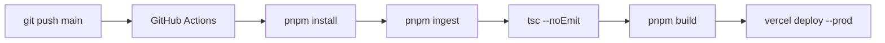

# KB — Interactive Learning Modules

A production-grade Next.js 14 site serving interactive simulators on **crude oil trading** and **generative AI engineering**. Every simulator is a self-contained HTML file embedded via sandboxed iframe — no conversion, full interactivity preserved.

---

## Stack

| Layer | Choice |
|---|---|
| Framework | Next.js 14 (App Router) |
| Language | TypeScript 5.5 strict |
| Styling | Tailwind CSS 3 + CSS custom properties |
| Fonts | IBM Plex Mono · IBM Plex Sans · Bebas Neue |
| Icons | lucide-react |
| Package Manager | pnpm 10 |
| Deploy | Vercel (auto via GitHub Actions) |

---

## Project Structure

```
Blog/
├── .claude/                  # Claude Code context & skills
│   ├── claude.md             # Full project context for AI assistant
│   ├── MEMORY.md             # Memory index
│   └── skills/
│       └── add-post.md       # How to add a new simulator
├── .github/
│   └── workflows/
│       └── deploy.yml        # CI/CD: build → Vercel
├── public/
│   └── simulations/          # HTML simulator files (static assets)
│       ├── oil-trading-simulator.html
│       ├── exposure-report-clean.html
│       ├── trading-reports-explained.html
│       ├── freight-logistics-simulator.html
│       ├── GenAI_Curriculum_Phases1-3.html
│       └── GenAI_Curriculum_Phases4-6.html
├── scripts/
│   └── ingest-html.ts        # Validation: posts.ts ↔ public/simulations/
├── src/
│   ├── app/
│   │   ├── layout.tsx        # Root layout: fonts, header, footer
│   │   ├── page.tsx          # Home: hero + filter + grid
│   │   ├── globals.css       # CSS vars, Tailwind layers, utilities
│   │   ├── oil-trading/
│   │   │   ├── page.tsx      # Category listing
│   │   │   └── [slug]/
│   │   │       └── page.tsx  # Simulator page
│   │   └── genai/
│   │       ├── page.tsx
│   │       └── [slug]/
│   │           └── page.tsx
│   ├── components/
│   │   ├── content/
│   │   │   ├── PostCard.tsx
│   │   │   ├── CategoryFilter.tsx
│   │   │   ├── SimulatorFrame.tsx
│   │   │   └── DownloadButton.tsx
│   │   ├── layout/
│   │   │   ├── SiteHeader.tsx
│   │   │   └── SiteFooter.tsx
│   │   └── ui/
│   │       ├── Badge.tsx
│   │       ├── Button.tsx
│   │       └── SearchBar.tsx
│   ├── hooks/
│   │   └── useFilter.ts
│   └── lib/
│       ├── types.ts          # Post, Category, Difficulty, AccentColor
│       ├── posts.ts          # Content registry (source of truth)
│       └── utils.ts          # cn(), formatDate(), color maps
└── docs/
    └── architecture.md       # Mermaid diagrams
```

---

## Architecture

```mermaid
graph TD
    A[User] -->|GET /| B[Home Page]
    A -->|GET /oil-trading| C[Category Page]
    A -->|GET /oil-trading/slug| D[Simulator Page]

    D --> E[SimulatorFrame]
    E -->|src=| F[/public/simulations/*.html]

    G[posts.ts] -->|getPostsByCategory| C
    G -->|getPostBySlug| D
    G -->|getAllPosts| B

    H[pnpm ingest] -->|validates| G
    H -->|checks| F
```



---

## Getting Started

```bash
# Install
pnpm install

# Validate simulation files
pnpm ingest

# Dev server
pnpm dev

# Production build
pnpm build
pnpm start
```

---

## Adding a New Simulator

1. Copy your `.html` file to `public/simulations/`
2. Add an entry to `src/lib/posts.ts`:
   ```ts
   {
     slug: 'my-new-simulator',
     category: 'oil-trading',          // or 'genai'
     title: 'My New Simulator',
     subtitle: 'One-line technical description',
     description: 'Longer description for cards and metadata.',
     tags: ['tag1', 'tag2'],
     simulationFile: '/simulations/my-new-simulator.html',
     difficulty: 'intermediate',
     readTime: 20,
     lastUpdated: '2026-01-01',
     featured: false,
     downloadable: true,
     accentColor: 'accent',            // accent | gold | blue | danger | purple | teal
     icon: '📊',
   }
   ```
3. Run `pnpm ingest` to validate
4. `pnpm dev` to test locally
5. Commit and push — Vercel deploys automatically

---

## CI/CD Setup (one-time)

1. Push repo to GitHub
2. Import project on [vercel.com](https://vercel.com)
3. Add these GitHub Actions secrets:
   - `VERCEL_TOKEN` — from Vercel account settings
   - `VERCEL_ORG_ID` — from `.vercel/project.json` after `vercel link`
   - `VERCEL_PROJECT_ID` — same file

---

## Color Palette

| Token | Hex | Usage |
|---|---|---|
| `accent` | `#00c896` | Primary CTA, oil-trading highlights |
| `gold` | `#f5a623` | Reports, warnings |
| `blue` | `#378ADD` | GenAI, info |
| `danger` | `#ff4d6d` | Risk, exposure |
| `purple` | `#8b5cf6` | Advanced GenAI |
| `teal` | `#14b8a6` | Secondary |
| `bg` | `#0a0e14` | Page background |
| `surface` | `#111820` | Cards, header |
| `border` | `#1e3a52` | All borders |
