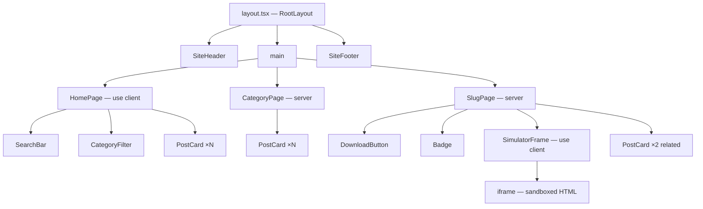
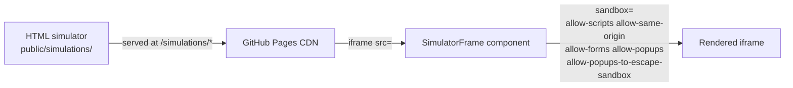
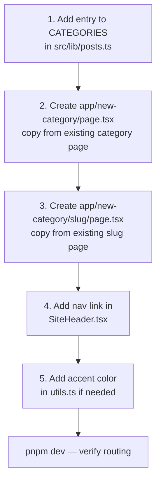
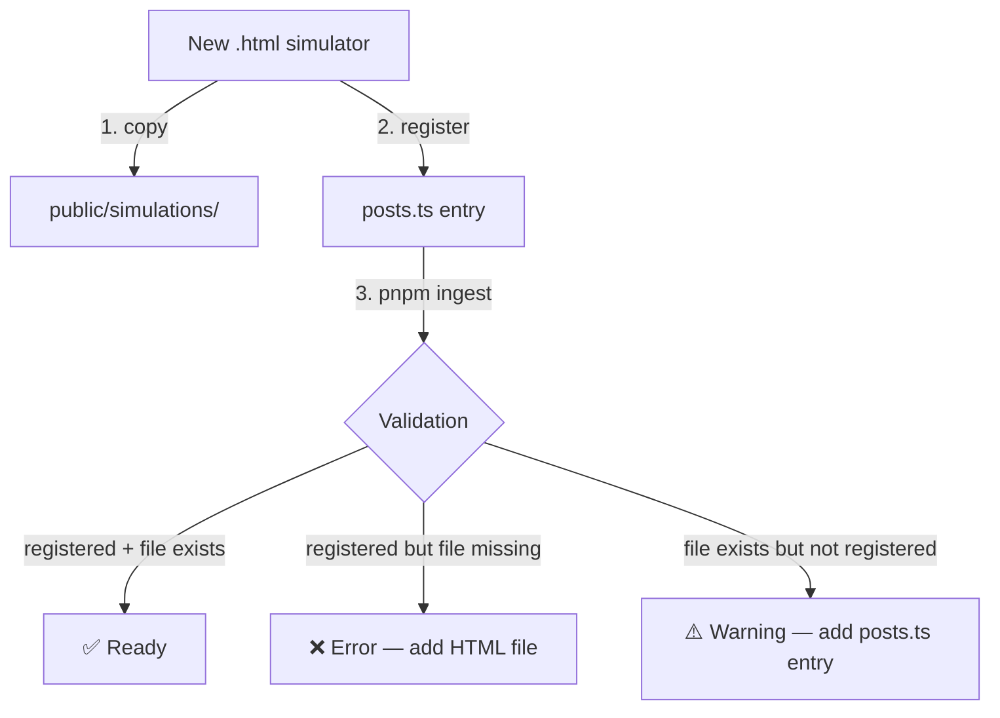

# Architecture

This document covers the technical architecture of the KB interactive learning platform.

---

## Request Flow

Every page is statically generated at build time. The browser receives pre-rendered HTML with no server-side runtime.

```mermaid
graph TD
    U[Browser] -->|GET /| HP[Home Page]
    U -->|GET /oil-trading| OT[Oil Trading Category]
    U -->|GET /genai| GA[GenAI Category]
    U -->|GET /oil-trading/:slug| OTS[Simulator Page]
    U -->|GET /genai/:slug| GAS[Simulator Page]

    OTS --> SF[SimulatorFrame component]
    GAS --> SF

    SF -->|iframe src=| SIM[/public/simulations/*.html\nFull JS preserved, sandboxed]

    PR[src/lib/posts.ts\nsingle source of truth] -->|getPostsByCategory| OT
    PR -->|getPostsByCategory| GA
    PR -->|getAllPosts| HP
    PR -->|getPostBySlug| OTS
    PR -->|getPostBySlug| GAS
```

---

## Component Tree



---

## Data Flow

All content lives in `src/lib/posts.ts`. There is no CMS, database, or API — just a typed TypeScript array that drives static generation.

```mermaid
flowchart LR
    subgraph Registry ["src/lib/posts.ts"]
        PT[Post\[\] array]
    end

    subgraph Pages
        HP[Home]
        OT[/oil-trading]
        GA[/genai]
        OS[/oil-trading/:slug]
        GS[/genai/:slug]
    end

    subgraph Assets ["public/simulations/"]
        SIM[*.html files]
    end

    PT -->|getAllPosts| HP
    PT -->|getPostsByCategory| OT
    PT -->|getPostsByCategory| GA
    PT -->|getPostBySlug| OS
    PT -->|getPostBySlug| GS
    OS -->|simulationFile| SIM
    GS -->|simulationFile| SIM
```

---

## iframe Embedding Strategy

Rather than converting each simulator to React (which would require rewriting thousands of lines of JS), each HTML file is served as a static asset and embedded via a sandboxed `<iframe>`. This preserves 100% of the original interactivity.



**Security:** The `sandbox` attribute restricts the iframe to only what it needs. `allow-top-navigation` is intentionally excluded.

### External links inside simulators (Resource Vault)

GitHub Pages sets `Cross-Origin-Opener-Policy` headers. When a sandboxed iframe opens a new tab, that tab inherits the security context and external sites (YouTube, docs, etc.) respond with `ERR_BLOCKED_BY_RESPONSE`.

**Fix — postMessage bridge:**

```
iframe (vault link clicked)
  └─ postMessage({ type: 'open-url', url }) → parent window
       └─ SimulatorFrame listener → window.open(url, '_blank')
```

The link opens from the **parent page** context, completely outside the sandbox. Any simulator HTML file that has external links in a `.vault` block must include this script at the bottom:

```js
document.querySelectorAll('.vault a').forEach(function(a) {
  a.addEventListener('click', function(e) {
    e.preventDefault();
    window.parent.postMessage({ type: 'open-url', url: this.href }, '*');
  });
});
```

---

## CI/CD Pipeline


---

## Adding a New Category

The site supports any number of categories. To add one beyond `oil-trading` and `genai`:



---

## Content Ingestion



---

## Directory Structure

```
Blog/
├── .claude/                    # AI assistant context (Claude Code)
│   ├── CLAUDE.md               # Project conventions and context
│   └── skills/                 # Task-specific skill files
├── .github/
│   └── workflows/
│       └── deploy.yml          # CI/CD: install → validate → test → build → deploy
├── docs/
│   └── architecture.md         # This file
├── public/
│   ├── .nojekyll               # Prevents GitHub Pages Jekyll processing
│   └── simulations/            # HTML simulation files (6 total)
├── scripts/
│   └── ingest-html.ts          # Validation script
├── src/
│   ├── app/                    # Next.js App Router
│   │   ├── layout.tsx          # Root layout
│   │   ├── page.tsx            # Home page
│   │   ├── globals.css         # Global styles + CSS vars
│   │   ├── oil-trading/
│   │   │   ├── page.tsx        # Category listing
│   │   │   └── [slug]/page.tsx # Simulator page
│   │   └── genai/
│   │       ├── page.tsx
│   │       └── [slug]/page.tsx
│   ├── components/
│   │   ├── content/            # Domain components
│   │   │   ├── PostCard.tsx
│   │   │   ├── CategoryFilter.tsx
│   │   │   ├── SimulatorFrame.tsx
│   │   │   └── DownloadButton.tsx
│   │   ├── layout/
│   │   │   ├── SiteHeader.tsx
│   │   │   └── SiteFooter.tsx
│   │   └── ui/                 # Atomic components
│   │       ├── Badge.tsx
│   │       ├── Button.tsx
│   │       └── SearchBar.tsx
│   ├── hooks/
│   │   └── useFilter.ts        # Category + difficulty + search filter
│   └── lib/
│       ├── posts.ts            # Content registry
│       ├── types.ts            # Shared types
│       └── utils.ts            # Utilities + color maps
└── tests/
    ├── lib/                    # Unit tests: utils, posts
    ├── hooks/                  # Hook tests: useFilter
    └── components/             # Component tests: Badge, PostCard, SimulatorFrame
```
