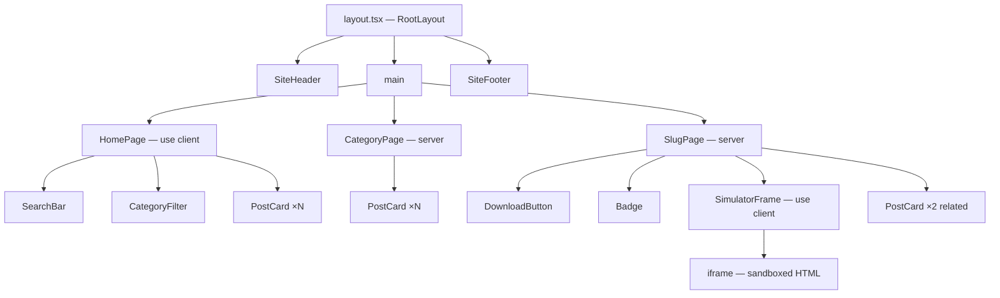
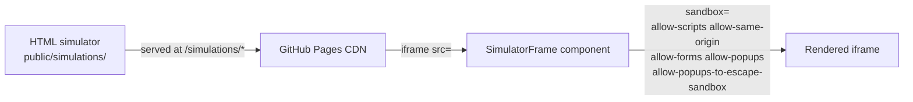
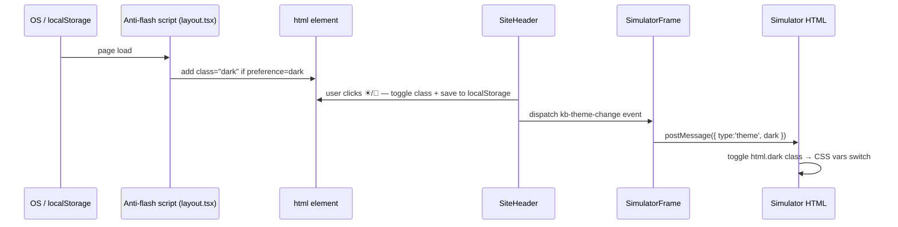
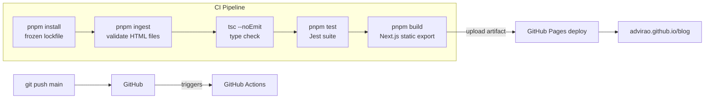
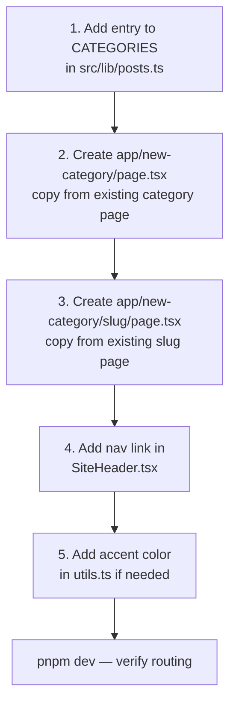
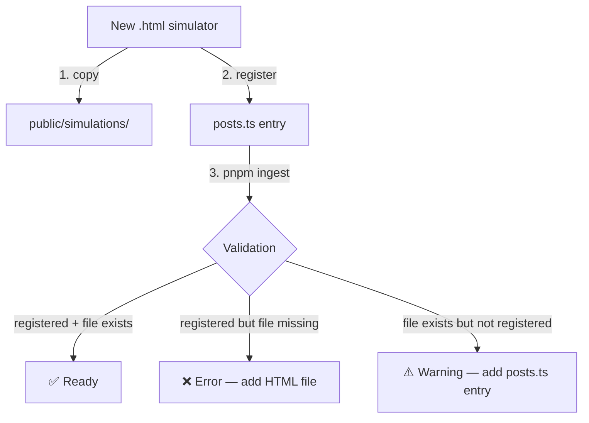

# Architecture

This document covers the technical architecture of the KB interactive learning platform.

---

## Request Flow

Every page is statically generated at build time. The browser receives pre-rendered HTML with no server-side runtime.

```mermaid
graph TD
    U[Browser] -->|GET /| HP[Home Page]
    U -->|GET /oil-trading| OT[Oil Trading Category]
    U -->|GET /genai| GA[GenAI Category]
    U -->|GET /claude-code| CC[Claude Code Category]
    U -->|GET /oil-trading/:slug| OTS[Simulator Page]
    U -->|GET /genai/:slug| GAS[Simulator Page]
    U -->|GET /claude-code/:slug| CCS[Simulator Page]

    OTS --> SF[SimulatorFrame component]
    GAS --> SF
    CCS --> SF

    SF -->|iframe src=| SIM[/public/simulations/*.html\nFull JS preserved, sandboxed]

    PR[src/lib/posts.ts\nsingle source of truth] -->|getPostsByCategory| OT
    PR -->|getPostsByCategory| GA
    PR -->|getPostsByCategory| CC
    PR -->|getAllPosts| HP
    PR -->|getPostBySlug| OTS
    PR -->|getPostBySlug| GAS
    PR -->|getPostBySlug| CCS
```

---

## Component Tree



---

## Data Flow

All content lives in `src/lib/posts.ts`. There is no CMS, database, or API — just a typed TypeScript array that drives static generation.

```mermaid
flowchart LR
    subgraph Registry ["src/lib/posts.ts"]
        PT[Post\[\] array]
    end

    subgraph Pages
        HP[Home]
        OT[/oil-trading]
        GA[/genai]
        CC[/claude-code]
        OS[/oil-trading/:slug]
        GS[/genai/:slug]
        CS[/claude-code/:slug]
    end

    subgraph Assets ["public/simulations/"]
        SIM[*.html files]
    end

    PT -->|getAllPosts| HP
    PT -->|getPostsByCategory| OT
    PT -->|getPostsByCategory| GA
    PT -->|getPostsByCategory| CC
    PT -->|getPostBySlug| OS
    PT -->|getPostBySlug| GS
    PT -->|getPostBySlug| CS
    OS -->|simulationFile| SIM
    GS -->|simulationFile| SIM
    CS -->|simulationFile| SIM
```

---

## iframe Embedding Strategy

Rather than converting each simulator to React (which would require rewriting thousands of lines of JS), each HTML file is served as a static asset and embedded via a sandboxed `<iframe>`. This preserves 100% of the original interactivity.



**Security:** The `sandbox` attribute restricts the iframe to only what it needs. `allow-top-navigation` is intentionally excluded.

**Theme:** Each simulator HTML file carries its own internal `<style>` block with matching CSS variables (`--bg`, `--surface`, `--ink`, etc.) and Google Fonts imports. They cannot inherit the blog's Tailwind CSS. See `docs/design-system.md` for the color reference.

**Responsive height:** The iframe height is CSS-driven via the `.sim-frame` class in `src/app/globals.css` — `85vh` on desktop, `60vh` on screens ≤ 768px. The `SimulatorFrame` component only overrides `minHeight` for fullscreen mode.

### postMessage bridge — two message types

Simulators communicate with the parent page via `window.postMessage`. There are two distinct flows:

**1. External links (iframe → parent)**

GitHub Pages sets `Cross-Origin-Opener-Policy` headers. When a sandboxed iframe opens a new tab, external sites respond with `ERR_BLOCKED_BY_RESPONSE`.

```
iframe (vault link clicked)
  └─ postMessage({ type: 'open-url', url }) → parent window
       └─ SimulatorFrame listener → window.open(url, '_blank')
```

Any simulator HTML file that has external links must use this pattern:

```js
document.querySelectorAll('.vault a').forEach(function(a) {
  a.addEventListener('click', function(e) {
    e.preventDefault();
    window.parent.postMessage({ type: 'open-url', url: this.href }, '*');
  });
});
```

**2. Dark/light theme sync (parent → iframe)**

The iframe is sandboxed and cannot read the parent page's CSS. When the user toggles the `☀/🌙` button, the theme is forwarded into the iframe:

```
User clicks toggle
  └─ SiteHeader: html.dark toggled + dispatches kb-theme-change event
       └─ SimulatorFrame: listens to kb-theme-change
            └─ postMessage({ type: 'theme', dark: true/false }) → iframe
                 └─ Simulator HTML: applies/removes html.dark class
```

Also fires on iframe load so the simulator always opens in the correct theme.

Any new simulator HTML must listen for this message:

```js
window.addEventListener('message', function(e) {
  if (e.data && e.data.type === 'theme') {
    document.documentElement.classList.toggle('dark', !!e.data.dark);
  }
});
```

And must have an `html.dark { ... }` CSS block with dark palette variables.

---

## Dark Mode

The site supports a full light/dark toggle persisted across sessions.

### How it works



### Implementation details

| File | What it does |
|---|---|
| `src/app/globals.css` | `:root` (light) and `html.dark` (dark) CSS variable sets + `--rgb-X` triplets for Tailwind opacity modifiers |
| `tailwind.config.ts` | Colors defined as `rgb(var(--rgb-X)/<alpha-value>)` — opacity modifiers work in both themes |
| `src/app/layout.tsx` | Inline `<script>` runs before paint; reads `localStorage` then OS pref; applies `dark` class; `suppressHydrationWarning` on `<html>` |
| `src/components/layout/SiteHeader.tsx` | `☀/🌙` button; toggles `html.dark`; saves to `localStorage`; dispatches `kb-theme-change` |
| `src/components/content/SimulatorFrame.tsx` | Listens to `kb-theme-change` + iframe `load`; postMessages theme into iframe |
| `public/simulations/*.html` | Must have `html.dark { ... }` CSS vars + `window.addEventListener('message', ...)` theme listener |

### Adding dark mode to a new simulator HTML

1. Add `html.dark { ... }` CSS block with dark values for all `--bg`, `--surface`, `--surface2`, `--border`, `--ink`, `--ink2`, and accent vars
2. Add the theme listener (see postMessage bridge section above)
3. All colors in the HTML must use CSS vars, not hardcoded hex — so they flip automatically

---

## Mobile Responsiveness

The site is fully responsive from 375px (small phone) to widescreen desktop.

### Navigation
`SiteHeader` hides nav links on mobile (`hidden md:flex`) and shows a hamburger `☰` button. Tapping it reveals a full-width dropdown; selecting a link auto-closes it. Implemented with a single `useState` toggle — no external library.

### Layout breakpoints
| Element | Mobile | Desktop |
|---|---|---|
| Nav links | Hidden — hamburger dropdown | Inline row |
| Simulator iframe | `60vh` min-height | `85vh` min-height |
| Home stats gap | `gap-6` | `gap-12` |
| Category spotlight cards | `p-5`, `min-h-[140px]` | `p-8`, `min-h-[160px]` |
| Difficulty filter buttons | `flex-wrap` | Inline row |
| Slug page meta: date | Hidden (`hidden sm:flex`) | Visible |
| Post icon | `text-3xl` | `text-4xl` |

### Simulator HTML (self-contained)
Each HTML simulator has its own responsive block. For the Claude Code simulator:
- **Sidebar** becomes a slide-in drawer on mobile (`position: fixed`, toggled by `toggleMobileSidebar()`)
- **Dark overlay** (`sidebar-overlay`) closes the drawer on tap-outside
- **Tabs** scroll horizontally (`overflow-x: auto`, `flex-wrap: nowrap`)
- **Loop phases** shift from a 5-item row to a 2-column grid
- **Simulator controls** stack vertically

---

## CI/CD Pipeline



---

## Adding a New Category

The site currently has three categories: `oil-trading`, `genai`, and `claude-code`. To add another:



---

## Content Ingestion



---

## Directory Structure

```
Blog/
├── .claude/                    # AI assistant context (Claude Code)
│   ├── CLAUDE.md               # Project conventions and context
│   ├── MEMORY.md               # Memory index for persistent context
│   ├── agents/                 # Specialized sub-agent definitions
│   ├── commands/               # Slash command definitions (e.g. /publish)
│   └── skills/                 # Task-specific skill files
├── .github/
│   └── workflows/
│       └── deploy.yml          # CI/CD: install → validate → test → build → deploy
├── docs/
│   ├── architecture.md         # This file
│   └── design-system.md        # Color palette, fonts, and design rules
├── public/
│   ├── .nojekyll               # Prevents GitHub Pages Jekyll processing
│   └── simulations/            # HTML simulation files (8 total)
├── scripts/
│   └── ingest-html.ts          # Validation script
├── src/
│   ├── app/                    # Next.js App Router
│   │   ├── layout.tsx          # Root layout
│   │   ├── page.tsx            # Home page
│   │   ├── globals.css         # Global styles + CSS vars
│   │   ├── oil-trading/
│   │   │   ├── page.tsx        # Category listing
│   │   │   └── [slug]/page.tsx # Simulator page
│   │   ├── genai/
│   │   │   ├── page.tsx
│   │   │   └── [slug]/page.tsx
│   │   └── claude-code/
│   │       ├── page.tsx
│   │       └── [slug]/page.tsx
│   ├── components/
│   │   ├── content/            # Domain components
│   │   │   ├── PostCard.tsx
│   │   │   ├── CategoryFilter.tsx
│   │   │   ├── SimulatorFrame.tsx
│   │   │   └── DownloadButton.tsx
│   │   ├── layout/
│   │   │   ├── SiteHeader.tsx
│   │   │   └── SiteFooter.tsx
│   │   └── ui/                 # Atomic components
│   │       ├── Badge.tsx
│   │       ├── Button.tsx
│   │       └── SearchBar.tsx
│   ├── global.d.ts             # CSS module type declaration
│   ├── hooks/
│   │   └── useFilter.ts        # Category + difficulty + search filter
│   └── lib/
│       ├── posts.ts            # Content registry
│       ├── types.ts            # Shared types
│       └── utils.ts            # Utilities + color maps
└── tests/
    ├── lib/                    # Unit tests: utils, posts
    ├── hooks/                  # Hook tests: useFilter
    └── components/             # Component tests: Badge, PostCard, SimulatorFrame
```
