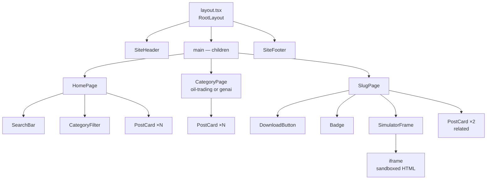
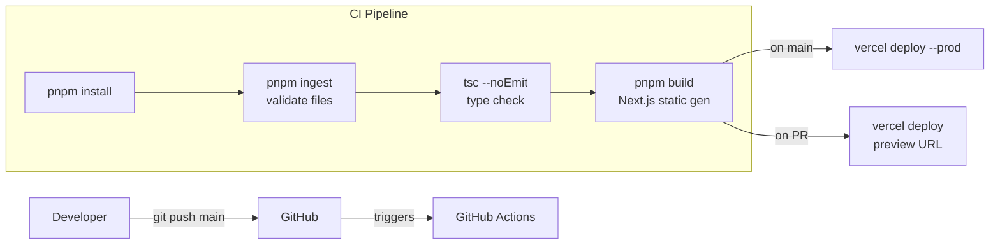
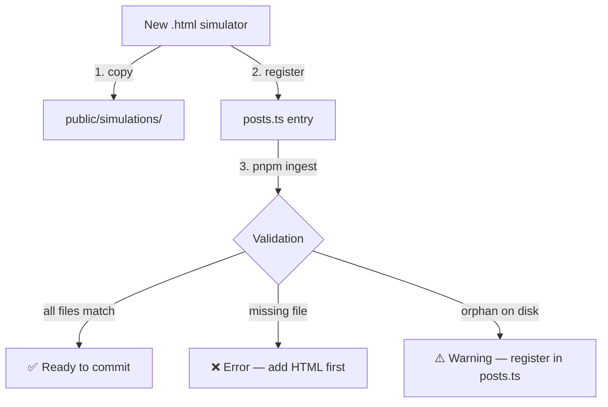

# Architecture Diagrams

## Request Flow

```mermaid
graph TD
    U[User Browser] -->|GET /| HP[Home Page<br/>page.tsx — 'use client']
    U -->|GET /oil-trading| OT[Oil Trading Category<br/>oil-trading/page.tsx]
    U -->|GET /genai| GA[GenAI Category<br/>genai/page.tsx]
    U -->|GET /oil-trading/:slug| OTS[Simulator Page<br/>oil-trading/[slug]/page.tsx]
    U -->|GET /genai/:slug| GAS[Simulator Page<br/>genai/[slug]/page.tsx]

    OTS --> SF[SimulatorFrame<br/>components/content/SimulatorFrame.tsx]
    GAS --> SF

    SF -->|iframe src=| SIM[/public/simulations/*.html<br/>Static asset — full JS preserved]

    PR[posts.ts<br/>lib/posts.ts] -->|getPostsByCategory| OT
    PR -->|getPostsByCategory| GA
    PR -->|getAllPosts| HP
    PR -->|getPostBySlug| OTS
    PR -->|getPostBySlug| GAS
```

## Component Tree



## Data Flow

```mermaid
flowchart LR
    subgraph Registry
        PT[posts.ts<br/>Post[]<br/>source of truth]
    end

    subgraph Pages
        HP[Home]
        OT[/oil-trading]
        GA[/genai]
        OS[/oil-trading/:slug]
        GS[/genai/:slug]
    end

    subgraph Static Assets
        SIM[/public/simulations/\n*.html]
    end

    PT -->|getAllPosts| HP
    PT -->|getPostsByCategory| OT
    PT -->|getPostsByCategory| GA
    PT -->|getPostBySlug| OS
    PT -->|getPostBySlug| GS
    OS -->|simulationFile path| SIM
    GS -->|simulationFile path| SIM
```

## CI/CD Pipeline



## Content Ingestion


